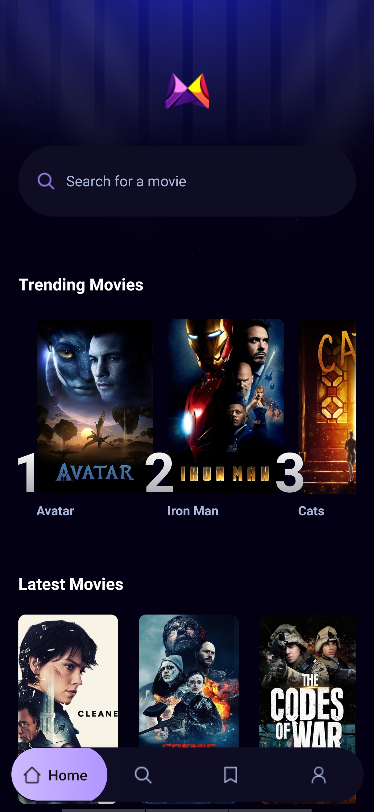
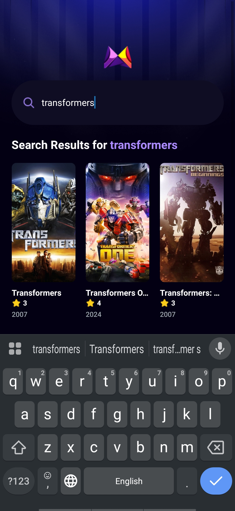
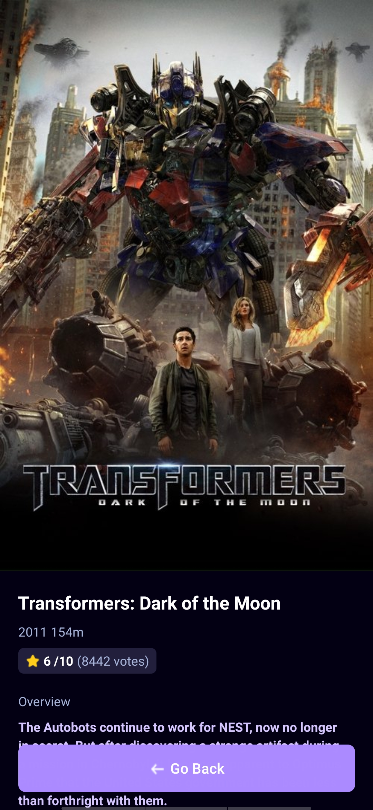

# MovieFlix - React Native Movie App

MovieFlix is a React Native application built with **Expo** that allows users to browse trending and latest movies, search for specific movies, and view detailed information about each movie. The app is styled using TailwindCSS and integrates with Appwrite and TMDB API for backend services.

## Features

- **Home Screen**: Displays trending and latest movies.
- **Search Functionality**: Search for movies by title.
- **Movie Details**: View detailed information about a selected movie, including genres, budget, revenue, and production companies.
- **Saved Movies**: Placeholder for saving favorite movies.
- **Profile Screen**: Placeholder for user profile information.
- **Trending Movies**: Displays the most searched movies using Appwrite's database.

## Tech Stack

- **React Native**: For building the mobile application.
- **Expo**: For development and deployment.
- **TailwindCSS**: For styling using the `nativewind` library.
- **Appwrite**: For backend services like database and API integration.
- **TMDB API**: For fetching movie data.

## Installation and Setup

1. **Clone the Repository**:
   ```bash
   git clone <repository-url>
   cd react_native_MovieApp
   ```

2. **Install Dependencies**:
   ```bash
   npm install
   ```

3. **Set Up Environment Variables**:
   Create a `.env` file in the root directory and add the following:
   ```
   EXPO_PUBLIC_MOVIE_API_KEY=<your_tmdb_api_key>
   EXPO_PUBLIC_APPWRITE_PROJECT_ID=<your_appwrite_project_id>
   EXPO_PUBLIC_APPWRITE_DATABASE_ID=<your_appwrite_database_id>
   EXPO_PUBLIC_APPWRITE_COLLECTION_ID=<your_appwrite_collection_id>
   ```

4. **Start the Application**:
   ```bash
   npx expo start
   ```

5. **Run on a Device**:
   - For Android: `npm run android`
   - For iOS: `npm run ios`
   - For Web: `npm run web`

## App Screenshots

### Home Screen


### Search Screen


### Movie Details Screen

